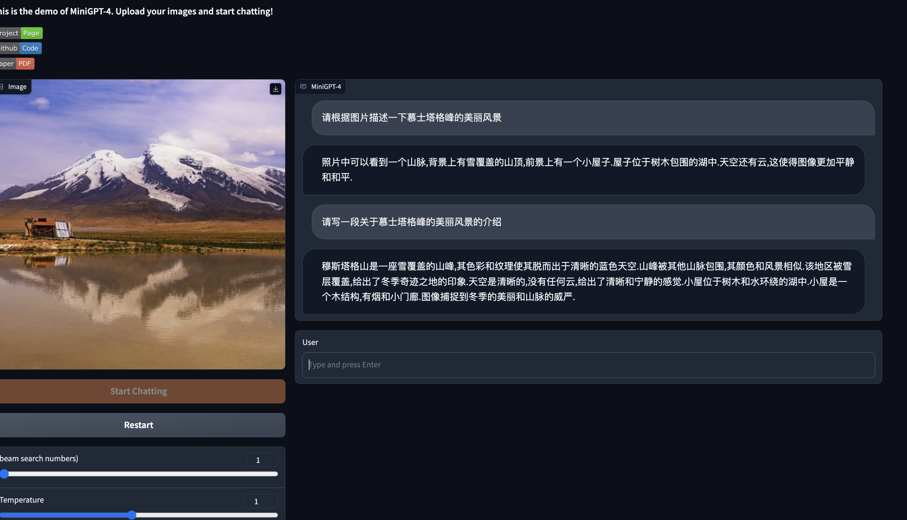

# MiniGPT-4中文支持方案
## 介绍
MiniGPT-4本身的语言大模型是基于LlaMA的，由于该模型对中文的支持不好。因此想了个折中的办法：
在模型的输入和输出分别加了一个翻译模型，用户输入（中文）-> 翻译模型（Chs-Eng） -> 大模型 -> 翻译模型（Eng-Chs）->返回结果

```
tokenizer_zh2en = AutoTokenizer.from_pretrained("facebook/nllb-200-distilled-600M")
model_zh2en = AutoModelForSeq2SeqLM.from_pretrained("facebook/nllb-200-distilled-600M")

translatorEng2Zho = pipeline(
    'translation',
    model=model_zh2en,
    tokenizer=tokenizer_zh2en,
    src_lang='eng_Latn',
    tgt_lang='zho_Hans',
    max_length=1024
)

translatorZho2Eng = pipeline(
    'translation',
    model=model_zh2en,
    tokenizer=tokenizer_zh2en,
    tgt_lang='eng_Latn',
    src_lang='zho_Hans',
    max_length=1024
)
```

## 如何运行
```
python3 demo_zh.py --cfg-path eval_configs/minigpt4_eval.yaml  --gpu-id 0
```
## 效果图
[]()

## 安装踩坑记录
- RuntimeError: The size of tensor a (32000) must match the size of tensor b (32001) at non-singleton dimension 0
解决方案：vicuna模型需要下载vicuna-7b-delta-v1.1，老的模型会报错
参考 [MiniGPT-4/issues/74](https://github.com/Vision-CAIR/MiniGPT-4/issues/132)
感谢 [Cola1999](https://github.com/Coca-Cola1999) 给与的支持!
- Probability tensor contains either inf, nan or element < 0
解决方案：修改`eval_configs/minigpt4_eval.yaml`,将`low_resource`设置为`False`
参考[MiniGPT-4/issues/74](https://github.com/Vision-CAIR/MiniGPT-4/issues/74)


## TODO
- 替换LlaMA模型为国产大模型，支持更高质量的中文交互